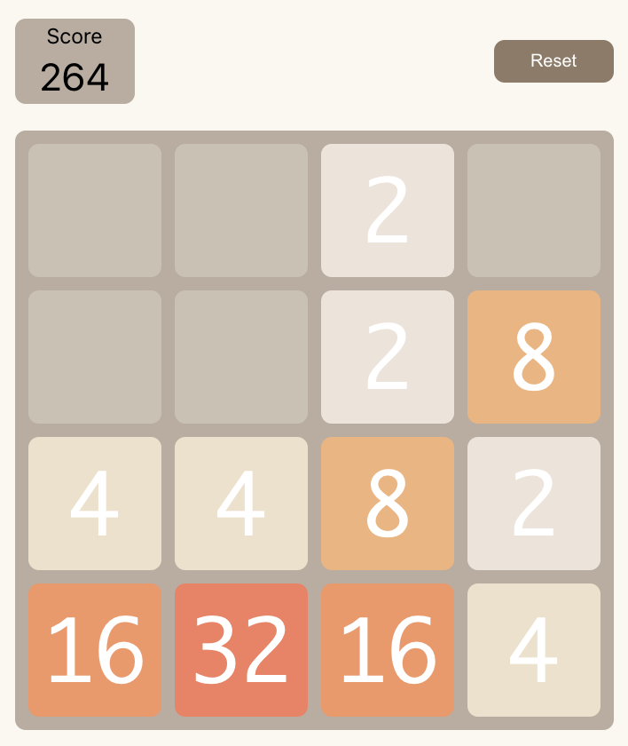

# 2048 Game



Famous game 2048 was created with React and Typescript.

This project was bootstrapped with [Create React App](https://github.com/facebook/create-react-app).

### For this project I have used these technologies:
- [React](https://reactjs.org/)
- [TypeScript](https://www.typescriptlang.org/)
- [Sass](https://sass-lang.com/)

## How to start

#### Intall [Node.js](https://nodejs.org/en/)

#### Download project

#### In root directory run
```
npm install
```
#### Run project
```
npm start
```

## How to play
Use arrow key (left, right, up, down) to move cells and try to combine cells with the same number.
The goal is to reach number 2048. Use reset button to reset game.

## Available Scripts

In the project directory, you can run:

### `npm start`

Runs the app in the development mode.\
Open [http://localhost:3000](http://localhost:3000) to view it in the browser.
